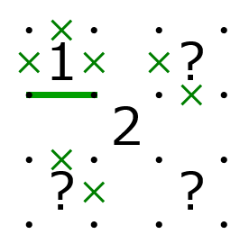

この記事は[ペンパアドベント AI Advent Calendar 2019](https://adventar.org/calendars/4262) 12 日目のものです．

# はじめに

以前 Twitter に

<blockquote class="twitter-tweet">
久しぶりに投稿です，これはかなり難しいと思います<a href="https://t.co/sOHWS1y8E7">https://t.co/sOHWS1y8E7</a> <a href="https://t.co/FLP2RWv9Fj">pic.twitter.com/FLP2RWv9Fj</a>
&mdash; 準急くき (@semiexp) <a href="https://twitter.com/semiexp/status/1194287224323395591?ref_src=twsrc%5Etfw">November 12, 2019</a></blockquote>  

このような問題を上げました．
この問題は自動生成プログラムで作ったものですが，大掛かりな理詰めが仕込まれていて，これに気づかないと解けない (or 極めて大変) なように作ってあります．

この記事では，この問題をどのようにして作ったかについて解説したいと思います．(なお，記事中にこの問題に関する多少のネタバレがあります)

# 自動生成アルゴリズム

今開発しているパズル自動生成のアルゴリズムは，基本的には PUZZLE GeneRator JaPan (http://puzzle.gr.jp/show/Japanese にあったのですが，今は残念ながら Forbidden になっています… WayBack Machine には一部残っているようです) にあった「ナンプレ自動生成エンジン」の手法を参考にしています．
これは，

- 未決定の状態（例えば，数独なら未決定マス，スリザーリンクなら線が引かれるか決まっていない箇所）が少なくなるように，ヒント変更を繰り返す

というものです．

これは，一種の最適化問題と見ることができます．つまり，探索空間を「ヒント配置（問題）」，目的関数を「未決定の状態の数」として，これが最小（唯一解：完全に解き切れるので未決定の状態がない）になるようなヒント配置を探す，という問題になります．

基本的には，未決定の状態を減らす方向にヒント変更を繰り返せばいいのですが，ヒント配置の制約をまったく与えない状態でこれを行うとどんどんヒントが増えてしまいます．
そのため，未決定の状態の個数に加えて，ヒント数に比例したペナルティを加味したスコアを用い，これを小さくする方向にヒント変更を行うようにしています．

「ナンプレ自動生成エンジン」では，最適化アルゴリズムとして山登り法（ヒントを変えて，未決定状態が少なくなる方向にだけ移動するアルゴリズム）を使っていたと記憶しています．
パズルと制約によっては山登り法でも十分なこともありますが，焼きなまし法（未決定状態が増える方向の移動も，確率的に許容する）を使ったほうが問題生成が効率よくなることも多いようです．（雑な検証ですが，ヤジリンの場合は山登り法でも問題生成はできるものの，難易度制約などを少し加えるとすぐに山登り法では困難になることがわかりました）最近は基本的に焼きなまし法を使っています．

## もう一つの自動生成アルゴリズム

この最適化は，焼きなまし法の代わりにビームサーチを使って行うこともできます．簡単に説明すると，

- ヒント配置の候補をたくさん持っておく．
- 各候補に対して，変更を加える（ヒントを増やすなど）ことで新たな候補を生成する．
- 新たな候補すべてを管理するとコストが大きいので，良さそうなもの（未決定の状態が少ないなど）を優先的に残して，ほかは捨てる．

というものです．
ヒント配置固定のスリザーリンクに対しては，この方法で自動生成を試したことがあります（ソースコードは残っていませんが）．ヒント配置によっては「このままだと複数解を避けられない」みたいなことが発生することがあり（例えば下図で，何も書かれていないマスにヒントを置かないとすると，どうやっても複数解になります），目的関数でこれを考慮してやるとある程度の効率で自動生成が可能になります．

ビームサーチはあまり自動生成では使っていないのですが，例外的にナンバーリンク自動生成（[ここ](https://semiexp.net/games/infinite_numberlink/index.html) で試すことができます）で使っています．
ナンバーリンクの場合は，ヒント配置を多少変えて解の数を減らすということがあまり期待できないため，解答盤面および対応する問題候補を多数生成し，唯一解のものだけを選び出すという手法で自動生成を行っています．
ここで解答盤面を作成する際に，ビームサーチに近いことを行っています．

## ソルバーの重要性

パズルを自動生成する上で，「未決定の状態」を数えるために，問題を解けるだけ解く（ソルバーに解かせる）ことが必要になります．
自動生成の過程ではヒント配置を変えて問題を何度も何度も解かせるため，当然ソルバーも何回も呼ばれることになります．
そのため，ソルバーは十分に高速に動作する必要があります．

ヤジリンやスリザーリンクなどのループ系パズルのソルバーでは，線を管理するデータ構造を工夫することで，効率よく解けるようにしています．
また，ぬりかべ，ぬりみさきなどの連結条件があるパズルでは，「このマスを黒マスにしても白マスが分断されないか？」といった判定が必要になります．
ナイーブなアルゴリズムでは 1 マスに対してこの検証を行うのに盤面の広さに比例した時間がかかるのですが，
lowlink などの手法 (参考: [JOI 2012 春合宿「倉庫番」解説](https://www.ioi-jp.org/camp/2012/2012-sp-tasks/2012-sp-day3-sokoban-slides.pdf)) を用いることで，盤面の広さに比例した時間ですべてのマスに対してこの検証を行うことができます．

また，ヤジリンソルバーでは，背理法なしで解ける問題の範囲を広げるため，様々な手筋を取り入れています（時々「理詰めで解けます」と言っているのは，主にこれらの手筋だけで解けることを指しています）．

# 自動生成で難しい問題を作る

コンピュータなら 2 段の背理法を適用して問題を解いたりするのも苦もなくやってしまうので，単に難しい問題を作るだけならそう大変ではありません．
が，そのようにして作った問題は，偶然に人間的な理詰めが現れることはあるものの，往々にしてただ大変なだけな問題になりがちです．

一方，人間が問題を作る場合，難しく非典型な理詰めを問題に埋め込むことができます．
コンピュータでもこのような問題は全探索などすれば（多少時間はかかるかもしれませんが）解くことはできます．
しかし，このような問題を自動生成する，すなわち難しい理詰めをプログラムに自動で発見させて問題に組み入れる，というのは極めて大変です．

そこで，先程の問題では「理詰めパートだけ人力で作ってしまう」という方法を用いました．具体的に述べると次のようになります：

1. コンピュータでも簡単には解けないような理詰めの機構を考える
2. その理詰めの機構を実現するヒント配置の構成を考える
3. 自動生成する際に，そのヒント配置をベースに生成する．また，このヒント配置に対しては，理詰めで得られる結果を直接ソルバーが使えるようにしておく．

一方，これだけだと問題があって，仕込んだ理詰めを使わなくても解けてしまう問題が生成される可能性があります．
その対策としては，自動生成する際に「この理詰めを使わないと手が進まない」という制約を加えればよいです．

この方法だと，理詰め機構さえ考えてしまえば，その機構を生かした問題を自動で作れるようになります．

# 今後の展開

先程の問題は，手動で理詰めを仕込んではいますが，その適用はかなり単純で，初期盤面にいきなりこの理詰めが現れています．
このようにした理由は主に「そのほうがプログラムが簡単だったから」なんですが，ある程度手が進んでからでないと現れない理詰めも考えられます．
現段階ではそこまでは対応しきれていませんが，方法としては

1. 理詰め機構に，手が進んでからでないと現れない要素（線を引くだとか，黒マスだとか）を含める
2. 自動生成の際に，この理詰め機構を適用できる方向に（例えば，ある黒マスが発生しやすくなるように）制約を加える

などが考えられます．
