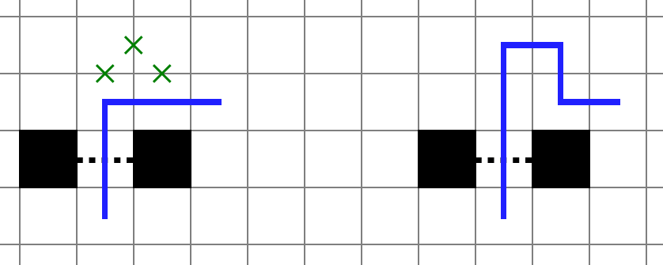
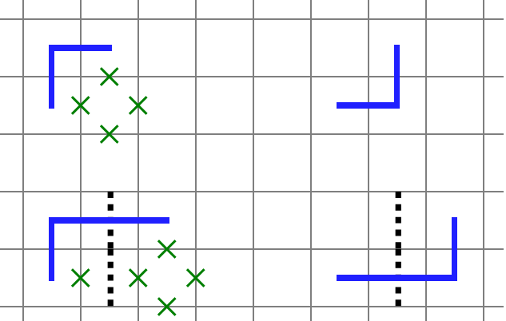
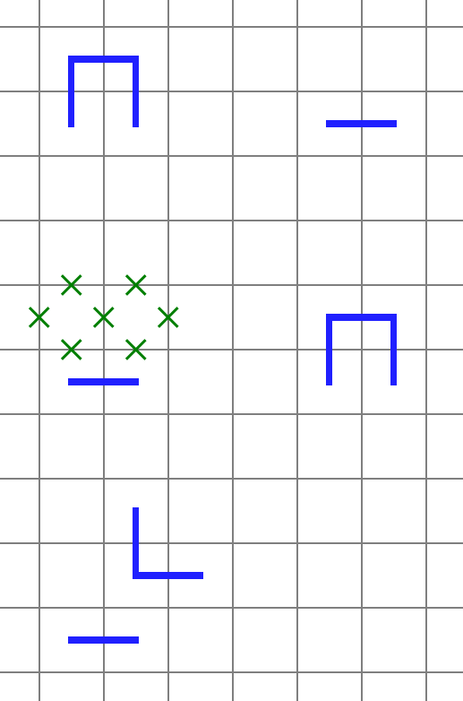

この記事は[ペンシルパズルI Advent Calendar 2020](https://adventar.org/calendars/5173) 19 日目のものです．

# はじめに

昨年末から、制約充足問題 (CSP) としてペンシルパズルを解くためのライブラリである [cspuz](https://github.com/semiexp/cspuz) を開発しています。
これを用いると、そもそも手筋すらわからないようなパズルに対しても、ルールを記述するだけでソルバーを作成することができます。

ソルバーを作ることができれば、ヒントを変えながら何度も自動解答を繰り返すことで問題を自動生成することもできます。（[参考](2019-12-12-puzzle-generator)）
さらに、表現力の高い CSP を経由して自動解答を行うことで、専用ソルバーでは実現が難しいような問題も生成することができます。
この記事では、cspuz を用いた自動生成の例についていくつか述べたいと思います。

# 初見ルールの自動生成

パズルコンテストでは、あまり見かけないバリアントルールなどが登場することがあります。
初見のルールだとそもそもどういう手筋があるのか良くわからないこともありますが、CSP を使うと手筋を何も知らなくてもルールさえわかればソルバーは実装することが可能です。あとは、適宜ヒントの置き方や変え方を決めてやれば、多くの場合問題の自動生成まで行うことが可能です。

例えば、以前 PGP Round 7 に出題された Loop (Portals) を[自動生成しました](https://puzsq.jp/main/puzzle_play.php?pid=10296)。
自動生成とはいえ予め問題を作って解いてみることで、パズルの手筋を多少なりとも理解するのに役立てることができました。

# 解答盤面に強い制約をかけた自動生成

以前、このようなシャカシャカを生成しました。

<blockquote class="twitter-tweet"><p lang="ja" dir="ltr">シャカシャカです，自動生成でこういうのも狙って作れるという一例<a href="https://t.co/eboEEC8b4D">https://t.co/eboEEC8b4D</a> <a href="https://t.co/1Dn5VTqclE">pic.twitter.com/1Dn5VTqclE</a></p>&mdash; 準急くき (@semiexp) <a href="https://twitter.com/semiexp/status/1241759479349166081?ref_src=twsrc%5Etfw">March 22, 2020</a></blockquote> <script async src="https://platform.twitter.com/widgets.js" charset="utf-8"></script> 

解いてみるとわかりますが、解答に比較的大きな正方形が現れます。
CSP ベースの自動生成だと、こういった問題も狙って作ることができます。

自動生成を行う際には、**問題が解を持つという条件を保ちつつ**、未決定のマスの個数が少なくなるようにヒントを変更していきます。
ここで、条件を「問題が解を持つ」から「**問題が大きい正方形を含んだ解を持つ**」という制約に強めると（唯一解判定ではこの制約は加えません）、最終的に唯一解になったときには解が大きい正方形を含んでいるので、意図通りの問題を作ることができます。

正確には、専用ソルバーを使った場合でも、予め大きい正方形の現れる場所を決めておけば、このような問題を作ることは難しくないと考えられます。
しかし、CSP を使った場合、正方形の位置を決める必要がない（どこかに現れる、という制約で十分対処できる）のと、より複雑な条件にも対応できる、というメリットがあります。
例えば、[Compass](http://puzzle-toketa.blogspot.com/2016/10/compass.html) で「ある領域が他の領域を取り囲んでいる」といった制約にも対応することが可能です。

# スラロームの自動生成

多くのパズルでは、ヒントを微調整して局所的な複数解を潰すということができます。
しかし、[スラローム](https://www.nikoli.co.jp/ja/puzzles/suraromu/) については、ループの近くにループの通っていないマスがあると容易に複数解が発生し、これをヒントの微調整で潰すのは容易ではありません。



一応ヒントの変更を繰り返して自動生成することは不可能ではないのですが、大きな盤面になるととても現実的な時間では唯一解に収束しなくなってしまいます。
そこで、スラロームの自動生成では、**盤面と解答の組を生成し、唯一解になるものを選ぶ** という方法をとっています。
これはナンバーリンクの自動生成と同様ですが、スラロームのほうが制約が複雑なため、専用の自動生成器を実装するのはかなり大変になります。
一方 CSP を用いると、制約を書き下すだけで盤面と解答の組を生成でき、かなり実装が楽になります。

## 制約の方針

一旦旗門を通る順番や、○のマスのことは考えないことにします。その上でどのような制約が必要かを考えます。

まず（当然ですが）盤面と解答の組はルールを満たしている必要があります。

- 旗門の両端は黒マスか盤面の外周になっている。
- ループはひとつながりになっていて、交差や枝分かれはない。
- すべての旗門を 1 回ずつループが通過する。

条件を満たす盤面と解答の組、というだけならこれだけで十分なのですが、解答を消して改めて解いたときに唯一解になっているものを探したいので、「どう考えても唯一解じゃないもの」は出てこないようにしたいです。
そのため、次のような制約も追加する必要があります：

- L 字で折り返して別解を得られるような箇所は存在しない（旗門が絡む場合を含む）。
  - 旗門が複数重なっている場合は面倒なので、簡単のためこれも禁止する。


- 明らかな遠回りや近道が可能な箇所は存在しない。
  - 「明らかな遠回りが不可能」は、隣り合った 2x2 のマス目について、(そのマス目内で完結する線の本数 + 1) < (そのマス目内で線の通るマスの数) とも言いかえられます。

下図の上段は近道が可能な例、中段は遠回りが可能な例です。下段は中段と同様の遠回りが不可能（なので問題ない）例です。



これらの制約を加えることで、（証明はしていませんが）通り方が「大域的には違わない別解を持たない」（別解があるとしたら黒マスを飛び越えた変形が必要）[^topology] ことが言えるはずです。

これだけだと、あまりに自明な盤面（例えば、線の通らないマスにはすべて黒マスが置かれているなど）が出てくる可能性があります。
適度な複雑さを持たせるために、次のような制約も追加します：

- 横向き / 縦向きの旗門が一定数以上存在する。
- 旗門に関わらない黒マスの個数は一定以下。

その他、黒マスは隣接しない、長さ 1 の旗門の個数は一定以下、などの制約を考えることもできます。

[^topology]: 数学的には、盤面のうち黒マスでないマスを適切に R^2 の部分位相空間とみなしたときに、元のループとこの位相空間上で homotopic になるような別のループを解として持たない、みたいな感じで言えるはずです

## 盤面の多様性

CSP ソルバーは同じ入力に対しては毎回同じ答えを返してくることがあります。すると、先述の制約だけでは毎回同じ盤面が得られることになってしまいます。
これでは困るので、実行するたびに異なる盤面が出てくるように、多様性のための制約を追加します。
これは、「このマスには線が通る」「このマスには線が通らない」という制約を何個かランダムに追加すれば十分です。

## 問題生成

盤面と解答の組ができたら、○と旗門ヒントを補って問題を生成します。
まず、○は線が通る（かつ旗門がない）マスをランダムに選んで置けばよいです。
そして、ループの向きもランダムに決めると、各旗門を何番目に通過するかも決まるので、ランダムにヒントを置くか置かないかを決めます。

こうしてできた問題は、必ずしも唯一解とは限らないので、改めてソルバーにかけて唯一解であるかを確かめる必要があります。
このとき、「決まる箇所をすべて決定する」ような解き方をする必要はなく、想定解と異なる解が存在しないことのみを確認すれば十分です。

# 自動生成の際のヒントの置き方、変え方

自動生成の際には、ヒントを変えつつ問題を解かせてどれくらい未決定マス（など）が残るかを見る、という工程が必要になります。
一方、ヒントの変え方はパズルによってはそんなに自明でないこともあります。
ここでは「ヒントの変え方」についていくつかの例を挙げてみたいと思います。

### ヒントが互いに（ほぼ）独立で、ヒントの存在が制約を強める一方の場合（数独、ビルディングパズル、スリザーリンク、ましゅなど）

この場合は、ヒントを置ける「枠」をランダムに選んで、その「枠」のヒントを増やす / 取り除く / 変更する といった変え方が考えられます。

ここで例に挙げたパズルでは、ヒントの追加が純粋に制約を強くしている（ある問題の解は、その問題からヒントを適当に取り去った問題の解でもある）という性質があります。一方、ヒント同士はほぼ干渉しないが、ヒントがないことも制約を強めることがあるパズル（ヤジリン、シャカシャカなど）もあります。この場合完全に「ヒントの存在が制約を強める一方」とは少し言いづらいですが、実際上はあまり気にせず先述のヒントの変え方を使って自動生成しても問題ないことが多いです。

### ヒントの不存在が決定的に解の質を変えうる場合（ぬりかべなど）

ぬりかべの場合、ヒントは「白マスシマの基点であること」と「白マスシマのマス数」の両方を表します。
さらに、白マスのマス数が少なすぎると解が存在しなくなる性質があるため、解が存在する範囲で問題を動かしていく場合、最初はかなり大きめのヒントを置く必要がありますが、ヒントが増えるに従ってヒントを小さくしていく必要が出てきます。
その代わりに、ヒントとして「？（白マスシマの基点だが、マス数が不明）」を許すことで、ヒントの不存在と存在の間のギャップを埋めることができ、比較的自動生成が行いやすくなると考えられます。

### 領域分割系のヒントを含む場合（へやわけ、スターバトル、LITS など）

領域を変える操作として、次のようなものを考えることができます。

- 隣接している領域を併合する
- 領域を 2 つの領域に分割する
- マスを 1 つ選び、それが属している領域から除去し、元々隣り合っていた領域に加える

へやわけの場合は、原則として領域は長方形になるため、最後の 1 マス入れ替えをそのまま行うことはできませんが、代わりに「隣接している領域の境界線をずらす」などを使うことができます。
また、スターバトルの場合は、領域の個数が固定されるため、併合や分割を行うことはできません。

### 独立でないヒントがある場合（キンコンカンなど）

キンコンカンのヒントは必ず 2 つペアになって現れるため、ヒントごとに独立に変えていくわけにはいきません。
そのような場合は、互いに関連するヒントをまとめて操作することが有効です。

# cspuz の自動生成機能について

cspuz には簡易的な自動生成ライブラリ `cspuz.generator` が付属しています。
先程述べたうち「ヒントが互いに（ほぼ）独立で、ヒントの存在が制約を強める一方」なパズルでは、この機能を使うと簡単に自動生成器を実装することが可能です。
例えば、[ましゅの自動生成器](https://github.com/semiexp/cspuz/blob/94e9058596fcbce2748def1eb7881fde888f3de8/cspuz/puzzle/masyu.py#L48-L53) はソルバー部分を除くとわずか 6 行で実装されています。ここでは、この自動生成機能の簡単な使い方を説明します。

```
from cspuz.generator import generate_problem, count_non_default_values, ArrayBuilder2D

def generate_masyu(height, width, symmetry=False, verbose=False):
    generated = generate_problem(lambda problem: solve_masyu(height, width, problem),
                                 builder_pattern=ArrayBuilder2D(height, width, [0, 1, 2], default=0, symmetry=symmetry),
                                 clue_penalty=lambda problem: count_non_default_values(problem, default=0, weight=10),
                                 verbose=verbose)
    return generated
```

`generate_problem` の最初の引数には、ソルバー関数を指定します。ソルバー関数は、問題を受け取って、(問題が解を持つかの真偽値, 解けるだけ解いた状態での盤面) の組 (tuple) を返す関数です。

`builder_pattern` には、問題の構造を指定します。
ここでは `ArrayBuilder2D` を使って構造を指定しています。これは 2 次元グリッド盤面を表すもので、引数 `[0, 1, 2]` は各マスに入る値の候補、`default=0` は各マスの初期値 (ここでは `0`: 空マス)、`symmetry` は初期値以外が置かれているマスを点対称にするか、を表します。

`clue_penalty` は、盤面のヒントによりどれくらいペナルティを与えるかを決める関数を指定します。
`count_non_default_values` は盤面、初期値 `default=0` (初期値以外が入っているマスに対してペナルティを与える)、マスごとのペナルティ `weight=10` を指定すると、初期値以外が入っているマスの数 * `weight` を計算する関数です。

`verbose` では自動生成の経過を出力するかを指定します。
